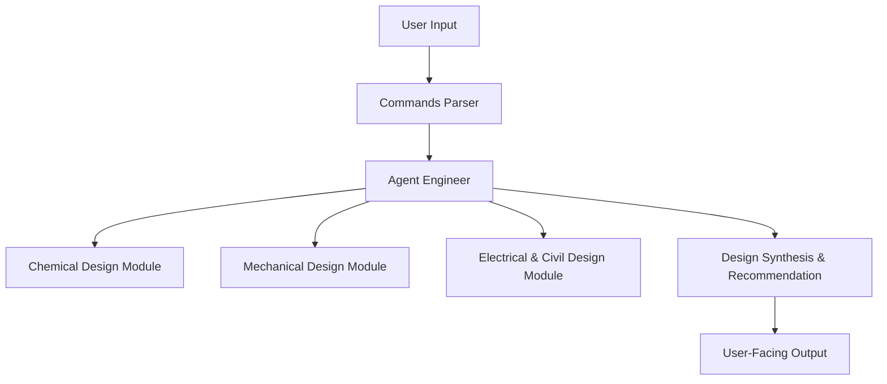

# Agent Engineer Design Diagram

Before proceeding, please ensure you have installed a Mermaid extension in VSCode. For example, you may use the "Markdown Preview Mermaid Support" extension available on the VSCode Marketplace.

Below is a sample Mermaid diagram that outlines the architecture for the Agent Engineer, covering chemical, mechanical, electrical, and civil design aspects:

This design shows that the Agent Engineer will receive user input, which the Commands Parser will forward to the Agent Engineer. Internally, the Agent Engineer splits the task across various design modules (chemical, mechanical, electrical & civil), synthesizes the designs, and finally outputs recommendations.

Feel free to modify the design diagram as you refine the agent's architecture.
