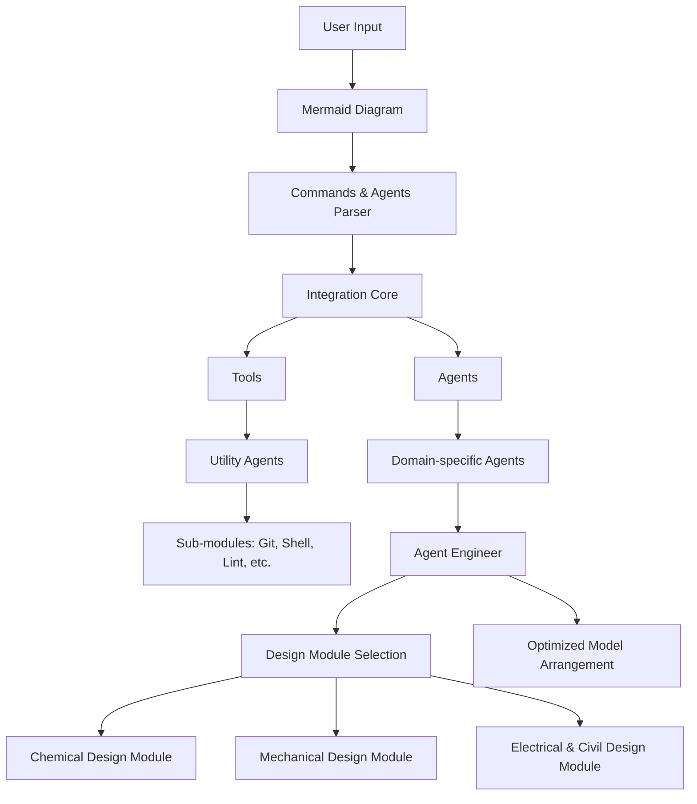

# Integration Diagram for Agents and Tools

This diagram illustrates the integration of agents and tools available in:
- `~/Tools/ai/*` (Tools for AI such as preprocessing, shell command integration, git interfacing, etc.)
- `~/Projects/Agents/` (Custom agents for specialized tasks)

The system is built using open source software and Python3. The diagram below outlines how user input is parsed and
dispatched to various modules and agents, including the Agent Engineer for design tasks.

**Helpful Suggestions for Agent Engineer:**
- **Embrace Modularity:** Split design tasks into specialized sub-modules (Chemical, Mechanical, Electrical & Civil) for
focused processing.
- **Leverage Open Source Tools:** Utilize existing tools from `~/Tools/ai/*` for tasks like version control (git), shell
execution, linting, and more.
- **Python3 Best Practices:** Build the agent using robust Python3 frameworks and libraries (e.g., Flask, FastAPI) to
ensure maintainability and scalability.
- **Integration Focus:** Ensure smooth integration between agents and external tools through a unified commands parser.
- **Community Driven:** Follow open source principles and encourage contribution to keep the agent evolving.